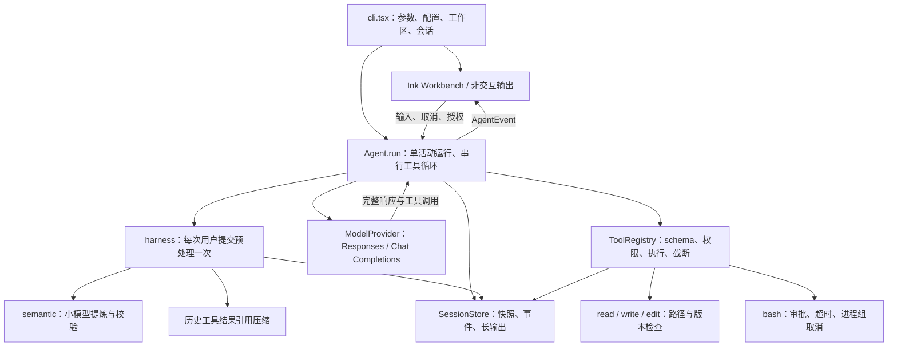

# 架构评估与下一步迭代计划

评估日期：2026-09-26。代码基线：`main` / `450a87a` / v0.1.0。

本轮方向：**可靠性与长任务完成能力**。本文第 1–5 节保留 2026-09-26 的架构评估与原始计划，源码行号和问题描述均对应上述基线。2026-09-27 已按计划在 `codex/reliable-long-runs` 实施，当前状态与证据见[实施记录](implementation-report.md)。原工期是单人专注开发的粗估，不是交付承诺。

## 1. 当前架构与判断

已经形成可用的单 Agent 编码闭环，适合在现有结构上迭代。核心不依赖 React；交互终端和非交互 CLI 共用 `Agent`。当前主要限制在任务完整性、循环中的上下文增长，以及恢复后的任务连续性。

| 层 | 现状与边界 | 主要源码 |
| --- | --- | --- |
| 启动与配置 | 配置合并、工作区、会话、TTY/JSON 分流；项目配置不能扩大权限 | [cli.tsx](../src/cli.tsx)、[load.ts](../src/config/load.ts) |
| 运行编排 | 单活动运行；完整收集模型响应后串行执行工具；维护调用配对、预算、取消、失败停止 | [agent.ts](../src/core/agent.ts) |
| 上下文 | 原始消息与模型视图区分；用户输入可提炼；旧工具输出可替换为可读取引用；工具轮次追加临时提醒 | [harness.ts](../src/core/harness.ts)、[semantic.ts](../src/core/semantic.ts) |
| 模型接入 | 一个 `Provider` 接口，两种协议实现；保留 Responses opaque 状态；显式拒绝未完成流 | [types.ts](../src/core/types.ts)、[model.ts](../src/providers/model.ts) |
| 工具执行 | 固定四工具；注册表同时承担参数验证、授权、分发、结果处理；文件工具有路径、哈希检查 | [registry.ts](../src/tools/registry.ts)、[paths.ts](../src/tools/paths.ts)、[bash.ts](../src/tools/bash.ts) |
| 持久化 | v1 JSON 快照、JSONL 事件、输出文件；原子替换快照；进程锁；恢复补齐未知结果且不重放副作用 | [store.ts](../src/sessions/store.ts) |
| UI | 流式文字、工具与 diff、思考展示、输入、授权、模型配置集中于 App 及子组件 | [App.tsx](../src/ui/App.tsx)、[Composer.tsx](../src/ui/Composer.tsx) |

应保留的设计：核心与 UI 分离、工具调用 ID 配对、Responses 状态保留、长输出引用、文件写入冲突检测、恢复不重放副作用、权限默认收敛。后续按功能提取模块即可，暂不需要服务化或重建整个框架。

## 2. 本次证据与验证范围

- 本机 `npm run check`、`npm test`、`npm run build` 全部通过；55 项测试通过，0 失败、0 跳过。
- 验证覆盖已有 runtime、harness、provider、配置和 Ink 交互测试。本次没有调用真实在线模型，没有做 Linux 主机验收，也没有重新做安装包端到端验收。
- 以下最小复现使用假 Provider 和隔离临时目录；未修改运行代码，临时目录已清理。

| 发现 | 当前证据 | 判断 |
| --- | --- | --- |
| 循环内缺少再压缩 | `agent.ts:44` 在循环前调用 `preparePrompt`；54 行超限即停；71、83 行持续追加。设上下文上限 50,000 字符，重复读取 6,000 字符文件，8 个结果后停止为 `context_limit`，预处理仅执行 1 次 | 已复现的长任务瓶颈。另一个 30,000 字符样例中，对停止后的同一历史再次预处理可从 30,802 降至 21,570 字符 |
| 提炼校验不能保证任务完整 | `semantic.ts:46–62` 校验字面量、路径、数字和部分显式约束。289 字符输入包含“先阅读文档，再修改代码，最后运行测试”，假提炼仅返回“阅读文档。”仍得到 `applied` | 已复现校验缺口；关键词保留不能证明动作及顺序保留。这不代表线上模型必然产生该输出 |
| 损坏会话恢复可能遗留锁 | `store.ts:25–35` 只浅校验消息，拿锁后处理消息未全部纳入失败清理。合法顶层会话中放入缺少 `calls` 的 assistant 消息，恢复抛错且留下锁；同进程再次恢复报告会话被占用 | 已复现异常路径；应在扩展会话状态前先修 |
| 长输入静默截断 | `Composer.tsx:14` 直接 `.slice(0, 20000)`，无提示；截断单位为 UTF-16 code unit | 源码确认。复杂任务可能在进入 runtime 前丢失尾部要求 |
| 预算语义不完整 | `agent.ts:55、61、74、78` 请求前检查，响应后记账；无工具的文本响应直接完成。假响应 usage=5,000、预算=1,000 时仍返回 `completed` | 已复现；预算目前不能被理解为严格费用上限，需明确超额状态及请求预算策略 |
| 恢复信息不完整 | `App.tsx:25–30` 恢复时过滤 tool 消息，36 行变更列表重新置空 | 源码确认。已有结果和 diff 在恢复界面不可回看 |
| 完成只表示模型本轮停止 | `agent.ts:74` 有文字且无工具调用就返回 `completed`；会话模型没有 task/checkpoint/验收记录 | 能力缺口，不等于循环实现错误；无法区分“模型回答结束”和“编码目标已验收” |

其他边界：只读模式只有 `read`，不能列目录或搜索；非交互模式无法批准 bash；bash 最长 60 秒，输出超过 256 KiB 会终止进程；模型配置测试只有文本响应。它们均有明确实现或文档说明，按后续需求逐项扩展。

## 3. 建议交付顺序

### 迭代一：需求与恢复完整性（v0.1.1，约 3–5 个工作日）

**目标：用户要求不会静默丢失，坏会话不会把恢复流程卡死，失败行为有自动化基线。**

1. **PR 1：输入与会话异常修复。** 超限输入明确拒绝并保留原草稿，或完整接收并提示大小；禁止默默提交被截断的内容。恢复前完整验证消息与调用结构；拿锁后的所有异常均释放本次持有的锁；损坏快照保留原件并给出可定位错误。
   - 验收：20,000 边界、中英文和组合 emoji；缺 `calls`、错误 message role、重复 ID、孤立 tool 结果、损坏 JSON 应明确拒绝。合法但未完成的 assistant 工具调用仍补齐为 `interrupted_unknown/not_executed`，不能一概视为损坏；恢复失败后可重试；活跃会话锁仍不可绕过；未知副作用仍不重放。
2. **PR 2：建立需求保真评测与保守默认值。** 增加包含顺序、条件、例外、否定、验收和引用材料的固定用例。建议下一版对未显式配置的用户默认使用 `local`，保留显式 `model/off` 配置；不把更短的文本或关键词覆盖率当作可靠性指标。显式启用语义提炼时，原始要求仍作为核对依据，展示回退/提炼状态。
   - 验收：上述遗漏步骤样例成为回归项；原文可读且不被覆盖；工具结果中的指令不能升级为用户要求；比较 `off/local/model` 的任务完成率、遗漏率、输入输出 token 和耗时后，再评估是否恢复默认模型提炼。自动字面校验不宣称证明语义等价。
3. **质量门禁随上述 PR 建立。** CI 使用锁文件安装，执行源代码及测试类型检查、测试、构建；补真实 CLI 子进程测试和临时包安装 smoke test。优先 Node 22、macOS/Linux，沿用 Windows shell 暂不支持的边界。
   - 验收：成功 0、审批 2、取消 130、错误 1；NDJSON 每行合法且 stdout 不混诊断；空 `ICY_HOME` 可安装启动。现有 55 项行为覆盖保持通过。

### 迭代二：循环内上下文与预算（v0.2 第一阶段，约 4–6 个工作日）

**目标：可压缩的历史不再导致过早停止，每次模型调用都有清楚的上下文与预算依据。**

4. **PR 3：提取 `ContextManager`。** 将“每次用户输入只运行一次的需求处理”与“每次模型请求前的上下文组装”分开。每轮检查字符硬限制和 token 估算，在接近阈值时外置较旧的大结果；引用按内容缓存，避免反复生成相同输出文件。
   - 首版沿用可恢复的结果外置，不直接丢弃历史消息。保留原始目标、约束、最近观察、调用结果配对和 Responses opaque 顺序。
   - 不能再缩小时，保存当前会话快照并报告具体原因；`RunState` 检查点在 PR 5 接入。需要改变历史语义的自动摘要放到独立评测门禁之后。
   - 验收：前述 50,000 字符样例在完成十次读取后能正常收尾；20 轮有界工具任务无需用户补发消息触发压缩；引用分页能回读原文；源会话不被压缩覆盖；两协议均无丢失/重复调用 ID；真正不可容纳的输入明确停止。
5. **PR 4：明确预算与停止原因。** 增加每次请求预算参数和结构化 usage（有则记录输入/输出/缓存等；无则明确估算），将预处理也记入同一 run。请求前预留响应空间，在协议支持时下发输出上限；响应后超过预算记录 `budget_exceeded`，不继续发起新模型或工具调用。
   - 验收：预处理消耗、无 usage、单次响应超额、工具前超额、上下文超额各有行为测试；UI/NDJSON 与持久化原因一致；文档说明估算及供应商计费造成的软上限边界。不能承诺仅靠 token 参数实现精确费用封顶。

### 迭代三：可恢复的任务执行与验收（v0.2 第二阶段，约 5–8 个工作日）

**目标：长任务中断后知道做到哪里、哪些操作结果未知、接下来如何继续；完成结论能对应验证证据。**

6. **PR 5：引入最小 `RunState` 和检查点。** 区分 `Session`（对话容器）、`Run`（一次有预算的执行）和任务状态（目标、已完成项、待办、阻塞原因、验证记录）。先支持一个会话内一个活动任务。取消、限制退出和进程重启后显式继续，延续原任务状态；是否开启新预算作为明确操作记录。
   - 状态涵盖运行、待批准、取消、受限停止、失败、模型结束、已验证完成。已验证完成需要具体检查的结果；无法验证的目标允许标注“已回答/未验证”，不凭模型一句话升级成功，也不强制所有问答执行测试。
   - 为 session schema 增加版本与迁移；旧会话没有的验收数据保持未知，不能回填成已成功。
   - 在副作用执行前、执行后但结果未落盘、结果落盘后分别做故障注入；结果未知时记录 `interrupted_unknown` 并检查实际状态，不能自动重放。保留取消与轮数/时间/token 上限，避免无界自动续跑。
7. **PR 6：恢复视图与会话入口。** 提取同一套 transcript 投影用于在线事件和历史恢复；恢复工具参数、结果、diff、未知状态与验证记录；增加 `icy sessions` 和会话选择入口。为长任务显示当前阶段、预算、停止原因与可执行的下一步。
   - 验收：恢复前后的工具顺序、结果和 diff 一致；未完成操作醒目标记；模型/工作区不匹配明确报错；旧 v1 会话迁移后仍可读取；失败不会破坏当前会话。

建议首个发布切片是 PR 1 + PR 2 + 质量门禁；随后 PR 3 → PR 4 → PR 5 → PR 6。PR 6 的投影拆分可与 PR 5 的状态模型并行，但合并验收依赖最终状态契约。

## 4. 目标模块边界

在现有模块中逐步提取职责，每次提取服务于具体功能：

- `Agent`：仅编排一次运行及状态转换，保持 UI 无关。
- `ContextManager`：每次请求生成模型视图、结果引用和上下文用量；用户需求处理仍每次提交一次。
- `RunState / Budget`：持久化任务进展、请求预算和结构化停止原因。
- `SessionStore`：负责 schema 校验、迁移、锁和检查点；快照仍为恢复事实来源，JSONL 暂作诊断记录，避免同时维护两套独立真相。
- `ToolRegistry / PermissionPolicy / Executor`：先把授权判断和具体实现从注册表提取；保留四工具接口与现有权限语义。
- `Transcript projection`：在线事件和持久化消息构造同一种视图；App 负责展示与输入。

`Provider` 后续增加能力描述与预算参数；协议差异继续留在 provider 层，Responses 专用数据不进入通用 UI/任务状态。对旧会话和工具 schema 的兼容要在迁移测试中明确覆盖。

## 5. 评估标准与后续队列

建立 10–15 个可复现的任务夹具：仓库阅读、跨文件修改、修改后验证、中文复杂要求、条件/顺序要求、长输出、模型中断、取消、批准拒绝、损坏会话、进程崩溃与恢复。确定性假模型用于控制流；受控真实模型评测用于验证任务理解与完成能力，两类结果分开报告。

发布看以下指标：

- **硬门禁**：需求不静默截断；工具调用与结果配对完整；未知副作用零自动重放；损坏会话不遗留本次锁；协议和恢复回归通过。
- **长任务效果**：前述可压缩上下文样例能完成；恢复后不重复已确认操作；完成记录有对应验证证据。
- **真实任务趋势**：任务成功率、需求遗漏率、每项成功任务的 token/耗时、人工批准次数；先建立当前版本基线再设目标，不把单次模型输出当作稳定统计结论。

核心三轮之后按真实失败数据排队：

1. **只读仓库探索**：在四工具约束下评估扩展 `read` 的目录/受限搜索能力；通过结构化参数执行、复用路径与敏感文件规则。涉及 schema 更新，单独验收双协议，避免简单按 bash 字符串前缀免审批。
2. **模型能力诊断**：在文本连接之外验证工具调用与结果续接，探测不执行主机工具；分别报告认证失败、协议不兼容和能力不足。
3. **长命令支持（第五轮已交付）**：已增加可查询/可取消的进程句柄与磁盘输出；恢复后只检查已有进程状态，不重复启动命令，详见[第五轮记录](gap-closure.md#2026-09-28第五轮迭代长命令支持)。评测数据未显示 bash 命中 timeout/output_limit，动机与限制如实记录在该节。
4. **MCP、多 Agent、后台任务编排、自动上下文摘要**：仍待后续迭代；等任务/权限/恢复契约及端到端门禁稳定后再做。多 Agent 额外需要文件修改冲突与授权传播设计。

最初评估仅交付计划；后续实施见[实施记录](implementation-report.md)。第 5 节“核心三轮之后”的探索、模型诊断及扩展能力仍为后续队列；长命令已按第五轮交付。

2026-09-29 起的后续顺序见[第六轮起的迭代计划](iteration-plan-6.md)，依据为同日的[整库代码审查](evaluations/code-review-2026-09-29.md)与[UI/交互审查](evaluations/ui-review-2026-09-29.md)。
